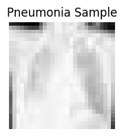
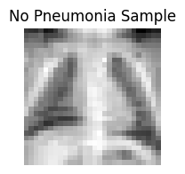

# EE532L Deep Learning for Healthcare - Programming Assignment 03

## Report (pa03_a.py)
Performance metrics: 

Figures:

Results and Observations:

## Report (pa03_b.ipynb)
Performance metrics: Accuracy= 0.75325

Figures:

Results and Observations: The neural network model achieved an accuracy of approximately 75%. Despite efforts to prevent overfitting, the accuracy remained consistent across epochs.

## About (pa03_a.py)
The Pima Indians Diabetes Database is a widely used dataset in machine learning, particularly for binary classification tasks related to diabetes prediction. The dataset consists of 768 instances. There are 8 numeric predictive attributes. The attributes are as follows:
 - Pregnancies: Number of times pregnant
 - Glucose: Plasma glucose concentration 2 hours in an oral glucose tolerance test
 - BloodPressure: Diastolic blood pressure (mm Hg)
 - SkinThickness: Triceps skin fold thickness (mm)
 - Insulin: 2-Hour serum insulin (mu U/ml)
 - BMI: Body mass index (weight in kg/(height in m)^2)
 - DiabetesPedigreeFunction: Diabetes pedigree function (a function which scores the likelihood of diabetes based on family history)
 - Age: Age in years

The target variable is a binary variable indicating whether a patient has diabetes or not. It takes the values 0 (no diabetes) or 1 (diabetes). Now your goal is to build a feed forward neural network from scratch, which includes 8 input neurons and 1 hidden layer with 3 neurons, to accurately classify individuals as diabetic or non-diabetic based on the given attributes.
This time you also have to perform validation. You have to plot graphs of all the metrics as done in the first programming assignment. Each graph should have both training as well as validation curve. If you notice overfitting then address it accordingly and write your observations 

## About (pa03_b.ipynb)
The PneumoniaMNIST consists of 5,856 pediatric chest X-Ray images. The task is binary-class classification of pneumonia against normal. The #Training/ Validation/Test is 4,708/524/624. Image size is 1 × 28 × 28.

The target variable is a binary variable indicating whether a patient has pneumonia or not. Now your goal is to build a feed forward neural network using tensorflow to accurately classify.
For this we have already provided you with a skeleton code, you just have to fill the snippets and tune the parameters. Similarly you have to plot the training and validation curves for all the metrics. You have to tune the hyperparameters accordingly if you notice overfitting in your plotted graphs.

## Instructions
  - Make sure you have a GitHub account. If you don't have one, create an account at [GitHub](https://github.com/).
  - Please accept this invite (shared in the Google Classroom) for the GitHub Classroom.
  - Once you accept the assignment invitation, you will be redirected to your assignment repository on GitHub.
  - You're supposed to only change the sections where you are allowed to do so in the pa03_a.py script.
  - Then upload or commit and push the changes to your assignment repo.
  - Your assignment will be automatically graded, otherwise, you will receive an email that the auto-grading has failed then make sure the code has no errors.

## References
- Smith, J.W., Everhart, J.E., Dickson, W.C., Knowler, W.C., & Johannes, R.S. (1988). Using the ADAP learning algorithm to forecast the onset of diabetes mellitus. In Proceedings of the Symposium on Computer Applications and Medical Care (pp. 261--265). IEEE Computer Society Press.
- Yang, Jiancheng, et al. "Medmnist v2-a large-scale lightweight benchmark for 2d and 3d biomedical image classification." Scientific Data 10.1 (2023): 41.

## License and Acknowledgement
The dataset is from [Kaggle](https://www.kaggle.com/datasets/uciml/pima-indians-diabetes-database/data?select=diabetes.csv) and [MedMNIST](https://medmnist.com/). Please follow their licenses. Thanks for their awesome work.

